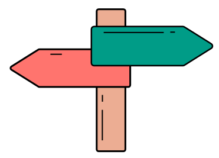

# अनुमार्गक (anumargak)
Fastest HTTP Router

<div align="center"></div>

[](https://snyk.io/test/github/naturalintelligence/anumargak) 
[](https://travis-ci.org/NaturalIntelligence/anumargak) 
[](https://coveralls.io/github/NaturalIntelligence/anumargak?branch=master) 
[](https://www.bithound.io/github/NaturalIntelligence/anumargak) 
[](https://npm.im/anumargak)


<a href="https://www.patreon.com/bePatron?u=9531404" data-patreon-widget-type="become-patron-button"></a>
<a href="https://www.paypal.com/cgi-bin/webscr?cmd=_s-xclick&hosted_button_id=KQJAX48SPUKNC"> </a>

## Features

* Fastest node js router (as far as Google & I know)
* Framework independent
* Supports static and  dynamic both type of URLs
* Supports path parameter with defined type `\this\is\:num([0-9]+)`
* Support multiple path parameters
* Handles enumerated URLs `\login\as\:role(admin|staff|user)`
* Supports wildchar `\this\is\*`, `\this\is\wild*`
* You nee not to register 2 separate routes for trailing slash. `\like\me\` and `\like\me`.
* Capture parameters' value for dynamic URLs.
* Warn (by default) or silently overwrites (when `overwriteAllow : true`) same or similar URLs
  * `\this\is\static` and `\this\is\static`
  * `\this\:param\is\dynamic` and `\this\param\:is\dynamic`
  * `\this\is\:uid([a-zA-Z0-9]+)` and `\this\is\:num([0-9]+)`
* Add similar but not same URLs
  * `\this\is\:age([0-9]+)` and `\this\is\:name([a-zA-Z]+)`
* Support of shorthand methods
* You can always have a count on registered routes.
* Supports versioned routes

## Usage

```js
const router = require('anumargak')({
  defaultRoute : defaultHandler,
  ignoreTrailingSlash: true,
  ignoreLeadingSlash: true,
});

anumargak.on("GET", "/this/is/static", handler);
anumargak.on(["POST","PUT"], "/this/is/static", handler);//supports array
anumargak.on("GET", "/this/is/:dynamic", handler);
anumargak.on("GET", "/this/is/:dynamic", handler);//it will overwrite old mapping
anumargak.on("GET", "/this/is/:dynamic/with/:pattern(\\d+)", handler);
//Eg: params = { dynamic : val, pattern: 123}
anumargak.on("GET", "/this/is/:dynamic/with/:two-:params", handler);//use - to separate multiple parameters
anumargak.on("GET", "/this/is/:dynamic/with/:two(\\d+):params", handler);
anumargak.on("GET", "/this/is/:dynamic/with/:two(\\d+)rest", handler);
anumargak.on("GET", "/similar/:string([a-z]{10})", handler);
anumargak.on("GET", "/similar/:number([0-9]{10})", handler);//above route is different from this


anumargak.quickFind("GET","/this/is/static");//will return { handler: fn, store: extraData }
anumargak.find("GET","/this/is/static");//will return { handler: fn, store: extraData, params: params}
anumargak.find("GET","/this/is/dynamic/with/123?ignore=me");//ignore query parameters and hashtag part automatically

anumargak.lookup(req,res) ;//will execute handler with req,res and params(for dynamic URLs) as method parameters

console.log(anumargak.count); //Print number of unique routes added
```

Example with server
```js
const http = require('http')
const router = require('anumargak')()

router.on('GET', '/', (req, res, params) => {
  //process the request response here
})

const server = http.createServer((req, res) => {
  router.lookup(req, res)
})

server.listen(3000, err => {
  if (err) throw err
  console.log('Server listening on: http://localost:3000')
})

```

**wildcard**: wild cards are helpful when a route handler wants to control all the underlying paths. Eg. a handler registered with `/help*` may take care of all the help pages and static resources under the same path.

```js
//this/is/juglee/and/
//this/is/juglee/and/wild
//this/is/juglee/and/wild/and/unknown
anumargak.on("GET", "/this/is/:dynamic/and/*", handler);

//this/is/juglee/and/wild
//this/is/juglee/and/wildlife
//this/is/juglee/and/wild/and/unknown
anumargak.on("GET", "/this/is/:dynamic/and/wild*", handler);
```

**shorthand methods**

```js
var router = Anumargak();

router.get("/this/is/:dynamic", () => 30);
router.head("/this/is/:dynamic", () => 30);
router.post("/this/is/:dynamic", () => 30);
router.put("/this/is/:dynamic", () => 30);
router.delete("/this/is/:dynamic", () => 30);
```

## Similar but not same URLs

You can register the URLs which look similar but not exactly same.

```js
const anumargak = require('anumargak')()
//this/is/my/75
anumargak.on("GET", "/this/is/my/:age([0-9]{2,3})", handler);

//this/is/my/amit
anumargak.on("GET", "/this/is/my/:name([a-zA-z]+)", handler);

anumargak.on("GET", "/login/as/:role(admin|user|staff)", handler);
anumargak.on("GET", "/login/as/:role(developer|tester|hacker)", handler);
```


## Named Expressions

Anumargak lets you add named expressions. You can use them at the time of registering the route.

```js

router.addNamedExpression("num","\\d+");
router.addNamedExpression({
   "name1" : "regx1",
   "name2" : "regx2",
});

```

Example routes

```js
/send/to/:phone(:phone:)
/authenticate/:token(:alphanum:)
```

Adding them make this router simple to use.

## accept-version

Same routes can be registerd with different versions. Lookup method reads `accept-version` header to read the version or you can pass the version in find method directly.


```JavaScript
router.on('GET', '/some/route', { version: '1.2.0' }, (req, res, params) => {
  //..
})

router.get( '/some/route', { version: '1.2.3' }, (req, res, params) => {
  //..
})

router.find('GET', '/some/route', "1.2.3");
router.lookup(req, res);
```
Note that

* A route can be registered with and without version. In this case, if the `accept-version` header presents then versioned route handler will be returned.
* Value of `accept-version` header can be : "1.2.0", "1.2.x", "1.x", "*"

## Benchmark

| Method | URL type | अनुमार्गक (Anumargak) v1.7.0| Find My Way v1.15.1 |
|------|------|------|------|
| Find |static|24369856.07|2614866.631 |
| Find |dynamic|2405576.122|1106656.051 |
| Find |dynamic + query param|1665114.806|1082533.894 |
| Find |Enum|23151436.16|1298019.289 |
| Find |wildchar|2591342.638|1630995.248 |
| Find |versioned static|1958139.854|263611.4248 |
| Find |versioned Dynamic|465584.9696|315857.0792 |
| Look |static|23614465.42|2201314.59 |
| Look |dynamic|2032592.029|940862.1238 |
| Look |dynamic + query param|1403264.652|923533.114 |
| Look |Enum|12662923.03|1066446.935 |
| Look |wildchar|2251611.449|1335382.238 |
| Look |versioned static|1313886.055|0 |
| Look |versioned Dynamic|392754.437|252312.1124 |

*Note* : Above benchmark has been taken on 16gb RAM ubuntu 17.10 machine with node v9.5.0 and npm v5.6.0


### Worth to mention

- **[निम्न (NIMN)](https://github.com/nimndata/spec)** : Save up to 85% network bandwidth and storage space.
- **[imglab](https://github.com/NaturalIntelligence/imglab)** : Speedup and simplify image labeling / annotation process online. Supports multiple formats, one click annotation, easy interface and much more.
- [fast-lorem-ipsum](https://github.com/amitguptagwl/fast-lorem-ipsum) : Generate lorem ipsum words, sentences, paragraph very quickly. Pure JS implementation.
- [stubmatic](https://github.com/NaturalIntelligence/Stubmatic) : A stub server to mock behaviour of HTTP(s) / REST / SOAP services. You can also mock binary formats.
- [मुनीम (Muneem)](https://github.com/muneem4node/muneem) : A webframework made for all team members.
- [शब्दावली (shabdawali)](https://github.com/amitguptagwl/shabdawali) : Amazing human like typing effects beyond your imagination. Check [वार्ता](https://github.com/amitguptagwl/vaarta) for talking/chatting effect.


## Contributors
-  [amitguptagwl](https://github.com/amitguptagwl)
-  [rajeshdh](https://github.com/rajeshdh)
-  [shuklajay117](https://github.com/shuklajay117)

## Disclaimer

I initially used *find-my-way* npm package for [मुनीम (Muneem)](https://github.com/muneem4node/muneem) framework. But then I realized that lookup for static URLs is comparitively slower. Hence I develop this library. If you notice, I tried to keep the naming convention and syntaxes common wherever possible to reduce the time to switch from one library to another and to keep learning curve smaller.